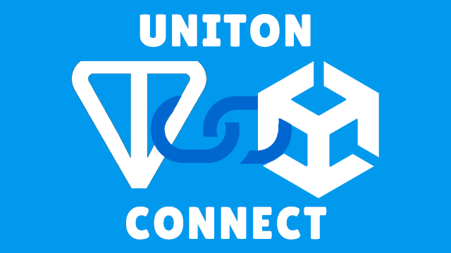
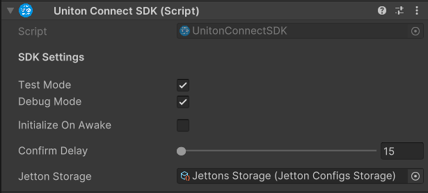
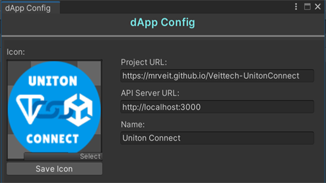

# UNITON CONNECT

[](LICENSE)
[](package.json)
[](https://unity.com/releases/editor/archive)
[]

<p align="left">
 
</p>

**UNITON CONNECT** is a user-friendly solution for working with the TON ecosystem inside web applications on Unity. 

### **Available functionality**
- Authorization via TON wallets (QR code or via Deep Link), 
- Executing transactions via Toncoin,
- Retrieving NFT collections from a connected wallet,
- Read wallet balance (as long as Toncoin is available),
- Conversion of wallet addresses into different formats and their visualization,
- Filtering of loaded nft collections by various filters: skam, collection address and so on.

### **Developing functionality**
- Read balance of basic (GRAM, NOT, DOGS) and custom jettons (by wallet master address),
- Sending basic and custom jettons, 
- Sending NFTs from available collections on the connected wallet,
- Swap custom and basic jettons to toncoin and reverse,
- Creating and mint of custom jettons,
- Create and mint NFT collections.

# Technical Demo

You can test the SDK without installation on a demo app [in your browser](https://mrveit.github.io/Veittech-UnitonConnect/) or directly [in the Telegram bot](https://t.me/UnitonConnect_bot/dAppStart).

# Supported Wallets & Platforms

|                Wallet Provider                | WebGL Desktop | WebGL Mobile |
| --------------------------------------------- |   :-------:   |  :--------:  |
| **Telegram Wallet**                           | ✔️           | ✔️           |
| **Ton Keeper**                                | ✔️           | ✔️           |
| **My Ton Wallet**                             | ✔️           | ✔️           |
| **Ton Hub**                                   | ⚠️           | ✔️           |
| **DeWallet**                                  | ❌           | ✔️           |
| **Bitget Wallet**                             | ⚠️           | ✔️           |
| **Safe Pal Wallet**                           | ⚠️           | ✔️           |
| **OKX Wallet**                                | ❌           | ❌           |
| **OKX TR Wallet (Turkiye)**                   | ❌           | ❌           |
| **Hot Wallet**                                | ❌           | ✔️           |
 
<sub>✔️ Supported</sub> &nbsp; <sub>❌ Not Supported</sub> &nbsp; <sub>⚠️ In progress</sub>

# Supported Wallets & Connection Types

|        Wallet Provider         | QR Code  | Deeplink |
| ------------------------------ | :------: | :------: |
| **Telegram Wallet**            | 💻+📱    | 💻+📱    |
| **Ton Keeper**                 | 💻+📱    | 💻+📱    |
| **My Ton Wallet**              | 💻+📱    | 💻+📱    |
| **Ton Hub**                    | 💻+📱    | 📱       |
| **DeWallet**                   | ❌       | 📱       |
| **Bitget Wallet**              | 💻+📱    | 📱       |
| **Safe Pal Wallet**            | 💻+📱    | 📱       |
| **OKX Wallet**                 | ❌       | ❌      |
| **OKX TR Wallet (Turkiye)**    | ❌       | ❌      |
| **Hot Wallet**                 | ❌       | 📱       |

<sub>💻 Desktop Client</sub> &nbsp; <sub>📱 Mobile Client</sub> &nbsp; <sub>💻+📱 All Clients</sub> <sub>❌ Not Supported</sub>

# Supported Tokens & Available Func

|           Token         |   Status   |       Func       |
| ----------------------- | :--------: | :--------------: |
| **TON**                 | ✔️         | Balance, Send    |
| **NOT**                 | ⚠️         | ⚠️              |
| **GRAM**                | ⚠️         | ⚠️              |
| **DOGS**                | ⚠️         | ⚠️              |
| **NFT**                 | ✔️         | Balance, Filter |
| **Custom Jetton**       | ⚠️         | ⚠️              |
 
<sub>✔️ Supported</sub> &nbsp; <sub>❌ Not Supported</sub> &nbsp; <sub>⚠️ In progress</sub>

# Dependencies

For the library to work correctly, the following dependencies **must be installed** in the project before use:
- **[WebGL Threading Patcher](https://github.com/VolodymyrBS/WebGLThreadingPatcher)** allows you to run asynchronous operations in a single thread in WebGL builds. 
Initially they do not work due to lack of multithreading support in them,
- **[Newtonsoft](https://www.youtube.com/watch?v=3H6xkl_EsvQ)** - modern solution for convenient work with json files.

# Installation

[Download the latest version of the SDK via the .unityPackage file here](https://github.com/MrVeit/unity-ton-connect/releases).

# Initialization

Before you can use all the features of the SDK, you must initialize it in **one of two available ways**.

#### Аutomatic initialization
The `UnitonConnectSDK` component has an option called `Initialize On Awake`. When you activate it, the SDK will initialize automatically. You only need to subscribe to the necessary events and start working with it.

<p align="center">
 
</p>

#### Manual initialization
Below is a test example of how it can look like.

```c#
public sealed class InitializationUsageTemplate : MonoBehaviour
{
    private UnitonConnectSDK _unitonSDK;
    
    private void OnDisable()
    {
        _unitonSDK.OnInitialized -= UnitonConnectSDKInitialized;        
    }

    private void Start()
    {
        _unitonSDK = UnitonConnectSDK.Instance;

        _unitonSDK.OnInitialized += UnitonConnectSDKInitialized;        

        _unitonSDK.Initialize();
    }

    private void UnitonConnectSDKInitialized()
    {
        Debug.Log("Success initialize Uniton Connect SDK");
    }
}
```

**At this point, you may encounter errors because your dApp application has not yet been configured.**

### Possible problems

If you just want to test the SDK, activate the `Test Mode` option of the `UnitonConnectSDK` component. In this case, the SDK will initialize the library's test application.
In case you want your application name, its logo and a link to the project itself to be displayed when connecting to the wallets. You need to enter these data in the `dApp Config` window, which is located at the `Uniton Connect -> dApp Config` path.

<p align="center">
 
</p>

Here you need to select your game/application logo, enter a title and provide a link to the site where it will be published.

**IMPORTANT:** Starting with `version 0.2.8`, you need to provide a link to your own API server, which uploads NFT collection images `bypassing CORS` and converts from `webP` to `jpeg` format (png format is available, but its size will take longer to load).
To raise your own API server on `Node.js`, go to the [Backend Set Up](https://github.com/MrVeit/Veittech-UnitonConnect/blob/main/README.MD#backend-set-up) section.

Now you need to do the first build of the project to generate the application configuration from the editor to a json file. 
Go to [Build](https://github.com/MrVeit/Veittech-UnitonConnect/blob/main/README.MD#build) to customize the build settings. 
After the first build and publishing the project to `Github Pages` or `another test server`, you can continue working with the SDK without any problem if you followed the second method.

# Usage Template

Now it's time for some examples of how to use the Uniton Connect library API. 
After successful initialization, you can request from the SDK a list of available wallets for further use. 

P.S: At this point, the library links to the **official repository with a json file** that lists the currently available wallets in the `Ton Connect ecosystem`. In future updates, you will have the option **to filter this list and generate**, similar to the configuration of your dApp, a json file with the crypto wallets used in the project.

### SDK Initialization

An example of a method call and processing its result is shown below:
```c#
public sealed class InitializationUsageTemplate: MonoBehaviour
{
    private UnitonConnectSDK _unitonSDK;

    private List<WalletConfig> _loadedWallets;
    
    private void OnDisable()
    {
        _unitonSDK.OnInitialized -= UnitonConnectSDKInitialized;        
    }

    private void Start()
    {
        _unitonSDK = UnitonConnectSDK.Instance;

        _unitonSDK.OnInitialized += UnitonConnectSDKInitialized;  

        _unitonSDK.Initialize();

        _unitonSDK.LoadWalletsConfigs(ProjectStorageConsts.
            TEST_SUPPORTED_WALLETS_LINK, (walletsConfigs) =>
            {
                CreateWalletsList(walletsConfigs);
            });
    }

    private void CreateWalletsList(IReadOnlyList<WalletConfig> walletsConfigs)
    {
        var walletsConfigs = WalletConnectUtils.GetSupportedWalletsListForUse(wallets);

        Debug.Log($"Created {walletsConfigs.Capacity} wallets");

        _loadedWallets = walletsConfigs;

        Debug.Log($"List of available wallet configurations: {JsonConvert.SerializeObject(walletsConfigs)}"); 
    }

    private void UnitonConnectSDKInitialized()
    {
        Debug.Log("Success initialize Uniton Connect SDK");
    }
}
```

You can now process the filtered wallet configurations for later display in the UI, or cache them for use later.
All code available for use in the library is fully documented. If you have any questions when working with the library API,
you can always see the implementation of all available functions in the `Example scene`.

### Connecting wallet

Now we need to add callbacks to get the connection status of the wallet in the app.

```c#
public sealed class ConnectionWalletUsageTemplate: MonoBehaviour
{
    [SerializeField, Space] private Button _connectTestWallet;
    [SerializeField, Space] private RawImage _qrCodePlace;

    private UnitonConnectSDK _unitonSDK;

    private List<WalletConfig> _loadedWallets;

    private WalletConfig _currentWalletForConnect;

    private string _connectURL;

    public UnitonConnectSDK UnitonSDK => _unitonSDK;
    public UserAssets.NFT NftStorage => _unitonSDK.Assets.NFT;
    
    public WalletConfig LatestAuthorizedWallet { get; private set; }
    
    private void OnDestroy()
    {
        _unitonSDK.OnInitialized -= UnitonConnectSDKInitialized;  

        _unitonSDK.OnWalletConnectionFinished -= WalletConnectionFinished;
        _unitonSDK.OnWalletConnectionFailed -= WalletConnectionFailed;  

        _connectTestWallet.onClick.RemoveListener(ConnectWallet);    
    }

    private void Start()
    {
        _connectTestWallet.onClick.AddListener(ConnectWallet);

        _unitonSDK = UnitonConnectSDK.Instance;

        _unitonSDK.OnInitialized += UnitonConnectSDKInitialized; 

        _unitonSDK.OnWalletConnectionFinished += WalletConnectionFinished;
        _unitonSDK.OnWalletConnectionFailed += WalletConnectionFailed; 

        _unitonSDK.Initialize();

        _unitonSDK.GetWalletsConfigs(ProjectStorageConsts.
            START_TON_WALLETS_LINK, (walletsConfigs) =>
            {
                CreateWalletsList(walletsConfigs);
            });
    }

    private void CreateWalletsList(IReadOnlyList<WalletConfig> wallets)
    {
        var walletsConfigs = WalletConnectUtils.GetSupportedWalletsListForUse(wallets);

        Debug.Log($"Created {walletsConfigs.Capacity} wallets");

        _loadedWallets = walletsConfigs;

        Debug.Log($"List of available wallet configurations: {JsonConvert.SerializeObject(walletsConfigs)}"); 

        GenerateQRCode();
    }

    private async void GenerateQRCode()
    {
        _currentWalletForConnect = _loadedWallets[0];

        _connectURL = await _unitonSDK.GenerateConnectURL(_currentWalletForConnect);
        _qrCodePlace.texture = WalletVisualUtils.GetQRCodeFromUrl(_connectURL);
    }

    private void ConnectWallet()
    {
        if (WalletConnectUtils.HasHttpBridge(_currentWalletForConnect))
        {
            _unitonSDK.ConnectHttpBridgeWalletViaDeepLink(_currentWalletForConnect, _connectURL);
        }
        
        if (WalletConnectUtils.HasJSBridge(_currentWalletForConnect) && _unitonSDK.IsUseWebWallets)
        {
            _unitonSDK.ConnectJavaScriptBridgeWalletViaDeeplink(_currentWalletForConnect);
        }
    }

    private void UnitonConnectSDKInitialized()
    {
        Debug.Log("Success initialize Uniton Connect SDK");
    }

    private void WalletConnectionFinished(Wallet wallet)
    {
        if (UnitonConnectSDK.Instance.IsWalletConnected)
        {
           var successConnectMessage = $"Wallet is connected, full account address: {wallet.Account.Address}, \n" +
               $"Platform: {wallet.Device.Platform}, " +
               $"Name: {wallet.Device.AppName}, " +
               $"Version: {wallet.Device.AppVersion}";

           var shortWalletAddress = WalletVisualUtils.ProcessWalletAddress(
               wallet.Account.Address.ToString(AddressType.Base64), 6);

           Debug.Log($"Connected wallet short address: {shortWalletAddress}");

           if (_loadedWallets != null)
           {
                 LatestAuthorizedWallet = WalletConnectUtils.GetConfigOfSpecifiedWallet(
                   _loadedWallets, wallet.Device.AppName);

                 Debug.Log($"The current wallet in the list is detected: " +
                   $"{JsonConvert.SerializeObject(LatestAuthorizedWallet)}");
           }

           return;
        }

        Debug.LogWarning($"Connect status: {UnitonConnectSDK.Instance.IsWalletConnected}");
    }

    private void WalletConnectionFailed(string message)
    {
        Debug.LogError($"Failed to connect " +
          $"the wallet due to the following reason: {message}");
    }
}
```

In this example, we create a link to connect to the current wallet in the `GenerateQRCode()` method, and generate a QR code to display on the connection panel.
Then, in the `ConnectWallet()` method to which the button was subscribed, the current configuration is checked for a specific bridge and further connection is made when the connect button is clicked.

**P.S:** HTTP and JavaScript connection bridges are differentiated by the way the deep links are navigated to the cryptocurrency wallet application/extension in the browser.

After successful connection via QR code or deep link, you will have connection status messages displayed in the console.
Here you can process the connected wallet **to get its configuration** and use it when sending a transaction later.
To nicely display the wallet address, the SDK has a method `WalletVisualUtils.ProcessWalletAddress(string address, int value)` that allows only the first and last characters of the address to be displayed.

P.S: Starting from `version 0.2.8`, you can change the address format of a connected TON wallet.

Conversion to `HEX/RAW` format:
```c#
string baseAddress = "UQDB2p0iHYcDK3Yq1kdliitRFaOK9LIynUgk-yXLZXmc2V5I";
string hexAddress = WalletConnectUtils.GetHEXAddress(baseAddress); 

//result: 0:c1da9d221d87032b762ad647658a2b5115a38af4b2329d4824fb25cb65799cd9
```

Conversion to `Bounceable` format:
```c#
string baseAddress = "UQDB2p0iHYcDK3Yq1kdliitRFaOK9LIynUgk-yXLZXmc2V5I";
string bounceableAddress = WalletConnectUtils.GetBounceableAddress(baseAddress); 

//result: EQDB2p0iHYcDK3Yq1kdliitRFaOK9LIynUgk+yXLZXmc2QON
```

Convert to `Non Bounceable` format:
```c#
string baseAddress = "EQDB2p0iHYcDK3Yq1kdliitRFaOK9LIynUgk+yXLZXmc2QON";
string nonBounceableAddress = WalletConnectUtils.GetNonBounceableAddress(baseAddress); 

//result: UQDB2p0iHYcDK3Yq1kdliitRFaOK9LIynUgk-yXLZXmc2V5I
```

**IMPORTANT:**
The `UnitonConnectSDK` has a `RestoreConnectionOnAwake` option that restores the last automatically saved session to the wallet. If it is activated, you can subscribe to the result of this event `UnitonConnectSDK.OnWalletConnectionRestored` and process the result if the response is successful.

### Sending Toncoin

After we plugged the wallet into the app. Now you can perform various operations with it.
At the moment in `version 0.2.8`, from the list of interactions with the wallet there is `only sending Toncoin` to the desired address. 
Therefore, below we will show an example of implementing only this function.

**P.S:** When the wallet functionality in `SDK Uniton Connect` is updated, the examples in the documentation will be updated.

```c#
public sealed class TransactionUsageTemplate : MonoBehaviour
{
    [SerializeField, Space] private ConnectionWalletUsageTemplate _walletEntryPoint;
    [SerializeField, Space] private Button _sendTransaction;

    private const string CREATOR_WALLET_ADDRESS = "EQDPwEk-cnQXEfFaaNVXywpbKACUMwVRupkgWjhr_f4UrpH_";
    private const double START_TON_AMOUNT = 0.01f;

    private void Start()
    {
        _walletEntryPoint.UnitonSDK.OnSendingTonFinished += TransactionSendingFinished;

        _sendTransaction.onClick.AddListener(Send);
    }

    private void OnDestroy()
    {
        _walletEntryPoint.UnitonSDK..OnSendingTonFinished -= TransactionSendingFinished;

        _sendTransaction.onClick.RemoveListener(Send);  
    }

    private async void Send()
    {
        await UnitonConnectSDK.Instance.SendTon(_walletEntryPoint.LatestAuthorizedWallet,
            CREATOR_WALLET_ADDRESS, START_TON_AMOUNT);
    }

    private void TransactionSendingFinished(SendTransactionResult? transactionResult, bool isSuccess)
    {
        if (isSuccess || transactionResult.HasValue)
        {
            Debug.Log($"Transaction sending was completed with status: {isSuccess}");
        }
    }
}
```

This example shows a test implementation of sending TonCoin to my TON address.
In the `UnitonConnectSDK.Instance.SendTon()` method you need to pass the configuration of the last authorized wallet, the recipient address and the quantity in `double`. 
If the transaction succeeds or fails, an `OnTransactionSendingFinished` event will be called, the result of which you can process.

**P.S:** The wallet configuration is used **to automatically redirect** when creating a transaction, for its subsequent confirmation.

### Loading NFT collections

Starting with `version 0.2.8`, the ability to obtain NFT collections from a connected wallet has been added.

Below you can see the implementation of downloading all NFT collections:

```c#
public sealed class LoadingNftCollectionsUsageTemplate : MonoBehaviour
{
    [SerializeField, Space] private ConnectionWalletUsageTemplate _walletEntryPoint;
    [SerializeField, Space] private Button _loadAllNftCollections;
    [SerializeField] private Button _loadTargetNftCollection;

    private UnitonConnectSDK _unitonConnect => _walletEntryPoint.UnitonSDK;
    private UserAssets.NFT _nftStorage => _walletEntryPoint.NftStorage;

    private void Start()
    {
        _nftStorage.OnNftCollectionsClaimed += NftCollectionsClaimed;
        _nftStorage.OnTargetNftCollectionClaimed += TargetNftCollectionClaimed;

        _nftStorage.OnNftCollectionsNotFounded += NftCollectionsNotFounded; 

        _loadAllNftCollections.onClick.AddListener(LoadAll);
        _loadTargetNftCollection.onClick.AddListener(LoadTarget);
    }

    private void OnDestroy()
    {
        _nftStorage.OnNftCollectionsClaimed -= NftCollectionsClaimed;
        _nftStorage.OnTargetNftCollectionClaimed -= TargetNftCollectionClaimed;

        _nftStorage.OnNftCollectionsNotFounded -= NftCollectionsNotFounded; 

        _loadAllNftCollections.onClick.RemoveListener(LoadAll);
        _loadTargetNftCollection.onClick.RemoveListener(LoadTarget);
    }

    private void LoadAll()
    {
        _nftStorage.Load(10);
    }

    private void LoadTarget()
    {
        //Address of Lost Dogs collection 
        string collectionAddress = "EQAl_hUCAeEv-fKtGxYtITAS6PPxuMRaQwHj0QAHeWe6ZSD0" 

        _nftStorage.LoadTargetCollection(collectionAddress, 10);
    }

    private async void NftCollectionsClaimed(NftCollectionData collections)
    {
        if (collections.Items.Count == 0)
        {
            Debug.LogWarning("No NFT collections was found on the wallet");

            return;
        }

        List<NftViewData> nftVisual = new();

        foreach (var nft in collections.Items)
        {
             var iconUrl = nft.Get100x100ResolutionWebp();

             Debug.Log($"Claimed icon by urL: {iconUrl}");

             var nftIcon = await WalletVisualUtils.GetIconFromProxyServerAsync(iconUrl);
             var nftName = nft.Metadata.ItemName;

             var newNftView = new NftViewData()
             {
                 Icon = nftIcon,
                 Name = nftName
             };

             nftVisual.Add(newNftView);

             Debug.Log($"Created NFT view with name: {nftName}");
        }
    }

    private void TargetNftCollectionClaimed(NftCollectionData collection)
    {
         UnitonConnectLogger.Log($"Loaded target nft collection:{collection.Items.Collection.Name}");
    }

    private void NftCollectionsNotFounded()
    {
         Debug.LogWarning("Nft collections not found");
    }
}
```

**IMPORTANT:** To download images from NFT collections, you cannot directly access the storage links, because each collection has its own servers configured. Therefore, an unsuccessful attempt to load a collection will return an empty picture due to CORS blocking the request.

To do this, you need to call the `await WalletVisualUtils.GetIconFromProxyServerAsync(iconUrl)` method, which calls your API server, which downloads the image from the source and gives it to your Unity client.

**P.S:** In addition, when you attempt to load webP images, the server performs conversion to `JPEG format`.
If you try to upload a `JPEG/PNG`, the image will be returned with the original format.

Before you can upload a picture of an item from the NFT collection, you must select an image format. 

```c#
private async void NftCollectionsClaimed(NftCollectionData nftCollections)
{
    var firstItem = collections.Items[0];

    string bestIconUrl = firstItem.GetBestResolutionPng();

    string littleIconUrl = firstItem.Get5x5ResolutionWebp();
    string smallIconUrl = firstItem.Get100x100ResolutionWebp();
    string mediumIconUrl = firstItem.Get500x500ResolutionWebp();
    string bigIconUrl = firstItem.Get1500x1500ResolutionWebp();
}
```

**P.S:** The method names reflect the size of the webp image in pixels.

### Loading TON balance

Starting with `version 0.2.8`, added possibility to get current balance of connected wallet **(only Toncoin at the moment)**.

Implementation of current balance request is shown below:

```c#
public sealed class LoadingTonBalanceUsageTemplate : MonoBehaviour
{
    [SerializeField, Space] private ConnectionWalletUsageTemplate _walletEntryPoint;
    [SerializeField, Space] private Button _loadBalance;
    [SerializeField] private TextMeshProUGUI _balanceBar;

    private UnitonConnectSDK _unitonConnect => _walletEntryPoint.UnitonSDK;

    private void Start()
    {
        _unitonConnect.OnTonBalanceClaimed += TonBalanceClaimed;

        _loadBalance.onClick.AddListener(LoadBalance);
    }

    private void OnDestroy()
    {
        _unitonConnect.OnTonBalanceClaimed -= TonBalanceClaimed;

        _loadBalance.onClick.RemoveListener(LoadBalance);
    }

    private void LoadBalance();
    {
        _unitonConnect.UpdateTonBalance();
    }

    private void SetTonBalance(decimal balance)
    {
        _balanceBar.text = $"Balance: {balance} TON";
    }

    private void TonBalanceClaimed(decimal tonBalance)
    {
        SetTonBalance(tonBalance);
    }
}
```

If you need to transfer your Ton balance to Nanoton and reverse, you can use the following methods:

```c#
private void TonBalanceClaimed(decimal tonBalance)
{
    SetTonBalance(tonBalance);

    decimal nanotons = UserAssetsUtils.ToNanoton(tonBalance);
    decimal tons = UserAssetsUtils.FromNanoton(nanotons)
}
```

# Build

In order to build a project, you must first configure several settings in the `Player Settings` window:
1. Set the custom `Uniton` build template, which is available after importing the library into the project. It can be set under `Build Settings -> Player Settings -> Resolution and Presentation -> WebGL Template`,
2. Then you need to switch the `Managed Stripping Level` property type to **Minimal**, so that the library functionality is not cut out when building the uniton and works correctly,
3. Now the final touches, under `Player Settings -> Publish Settings` you need to switch the `Enable Exception` property to any value except `Explicitly Thrown Exceptions Only`. Because if build errors occur, you can **freeze or even crash** the project.

After a successful build, **2 files** will be created in the build directory: `icon.png` and `dAppData.json`. These will contain all the information you entered earlier in the `dApp Config` window.
You can now publish your project anywhere you want. After publishing your project, go back to the `dApp Config` window and specify the correct link so that the SDK will work correctly with your project.

For test mode **I recommend** using `Github Actions` with their `Static Page` feature. A guide to deploying a WebGL build to Unity can be found online, so there's no need to describe it here.

# Backend Set Up

First, you need to download the source code of this Proxy Server, which the SDK accesses to load and convert pictures from NFT collections:

```
https://github.com/MrVeit/Veittech-UnitonConnect-ServerAPI
```

If you already have Node.js installed on your Windows computer (does anyone make Unity games on Linux? :D), you can skip this step and move on to the next one. If you still don't have it installed, you need to go to the official Node.js website and [install it yourself](https://nodejs.org/en/).

After installing and cloning the above two repositories, you can open the project in `VS Code` or `any other code editor` that **supports Node.js**.

Now, to be able to run the proxy locally and start testing, you need to create an environment variable repository. To do this, you need to create a file named `.env` in the project directory, but **without a file format**.

The following information must be filled in for the Proxy Server environment variables repository:

```config
HOST = http://localhost:
PORT = 3000
```

- Variable `HOST` is a link to your domain where the server is running, for testing purposes we will use the local address `http://localhost`,
- Variable `PORT` is a free port, which will listen to the proxy server to receive and send requests to the unity game client.

You can now run a proxy server to download pictures from nft collections. 
Open a terminal in the code editor in which you opened the project and type the following command:

```
npm start
```

**IMPORTANT:** In case you encounter a startup problem at this stage, it means you don't have Node.js installed or it was installed incorrectly.
Try reinstalling or searching for a solution to your problem on the Internet.

**P.S:** Now you can go back to the Unity project, open the dApp configuration window via `Uniton Connect -> dApp Config` and fill the `API Server URL` field with `http://localhost:3000`.

# Production Backend Deploy

```
Soon
```

# Donations

Ton Wallet (TON/NOT/USDt):
```
UQDPwEk-cnQXEfFaaNVXywpbKACUMwVRupkgWjhr_f4Ursw6
```

Multichain Wallet (BTC/ETH/BNB/MATIC)
```
0x231803Df809C207FaA330646BB5547fD087FEcA1
```

# Support

[](https://mail.google.com/mail/?view=cm&fs=1&to=misster.veit@gmail.com)
[](https://t.me/unigram_tools)
